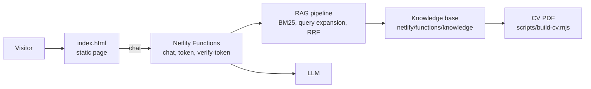

# Logan Venter Profile

Source for [loganventer.com](https://loganventer.com), Logan Venter's personal portfolio site. It is a static single-page site with an AI agent that answers questions about Logan's experience, skills and projects.

## Table of Contents

- [Overview](#overview)
- [Quick Start](#quick-start)
- [Project Structure](#project-structure)
- [Updating Content](#updating-content)
- [Scripts](#scripts)
- [Deployment](#deployment)
- [Keeping Internal Names Out](#keeping-internal-names-out)
- [License](#license)

## Overview

The frontend is hand-written HTML, Tailwind CSS from a CDN and modular ES6 JavaScript, with no bundler. The backend is a set of Netlify Functions that power the chatbot: a hybrid retrieval pipeline over a small knowledge base, tool calling, token-based access control and streaming responses.



## Quick Start

```bash
git clone https://github.com/loganventer/Logan.Venter.Profile.git
cd Logan.Venter.Profile

# Static page only (the chatbot needs the functions)
npx serve .

# Page and functions together
npm ci
npx netlify dev
```

The chatbot functions need an `ANTHROPIC_API_KEY` and the token signing secret in the environment. Set them in Netlify, or in a local `.env` file that is never committed.

## Project Structure

| Path | Holds |
| --- | --- |
| `index.html` | The whole page: every section, the navigation and the project cards |
| `css/` | Styles split by concern: `variables`, `base`, `nav`, `sections`, `projects`, `neural`, `chatbot` |
| `js/app.js` | The composition root that wires the components together |
| `js/components/`, `js/core/`, `js/contracts/`, `js/effects/` | Navigation, section routing, theme toggle, event bus and the neural background |
| `js/chatbot/` | The chat widget: access gate, streaming, message rendering |
| `netlify/functions/` | The chatbot backend: `chat`, `token`, `verify-token`, the RAG pipeline and the tool providers |
| `netlify/functions/knowledge/` | The knowledge base the chatbot and the CV are built from |
| `scripts/` | Build scripts for the RAG index and the CV, and the leak check |
| `assets/` | Images and the generated CV |
| `sw.js`, `manifest.json` | The service worker and the PWA manifest |

## Updating Content

Content lives in three places that must say the same thing:

1. `netlify/functions/knowledge/*.mjs` is the source for the chatbot and the CV. Edit this first.
2. `index.html` holds the same facts as hand-written markup. Edit it to match.
3. The CV PDF in `assets/documents/` is generated. Rebuild it with `npm run build:cv`, then point the three download links in `index.html` at the new file.

A project in `projects.mjs` may carry a `url`. The chatbot and the CV both show it.

After changing content, raise `SITE_VERSION` and set `SITE_UPDATED` in `sw.js`, and change the version line in `index.html` to match. It appears twice: under the name in the header and at the foot of the mobile menu. The new cache name makes returning visitors get the new version.

## Scripts

| Command | Does |
| --- | --- |
| `npm run build` | Builds the RAG index (`netlify/functions/rag-data.mjs`). Netlify runs this on every deploy |
| `npm run build:cv` | Renders the CV to a dated PDF in `assets/documents/` (needs Chrome through Puppeteer) |
| `npm run check:leaks` | Scans the published files for terms listed in `.leak-denylist` |

## Deployment

Netlify builds and deploys the `main` branch. `netlify.toml` sets the build command, the functions folder and the security headers, including the Content Security Policy. Images must be served from this site, because the policy blocks other image hosts.

## Keeping Internal Names Out

The site describes work done for employers in general terms. Before committing, run `npm run check:leaks`. It reads `.leak-denylist`, a local file with one term per line that is never committed, and fails when any term appears in a published file. Without that file the check does nothing.

## License

This project is licensed under the MIT License. See the [LICENSE](LICENSE) file for details.
